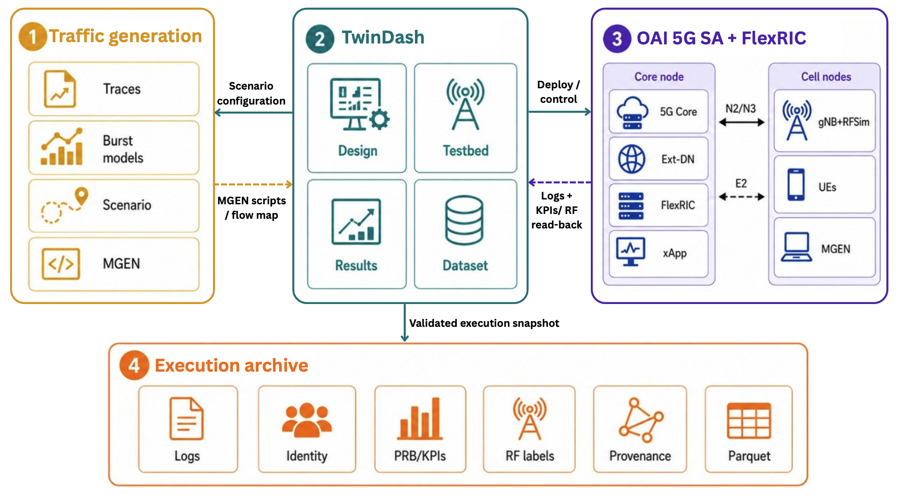

# TwinDash

[](https://github.com/GhinwaISMAIL/traffic-generation-dashboard/actions/workflows/quality.yml)
[](https://www.python.org/)
[](LICENSE)

TwinDash is a dashboard-based framework for designing, executing, validating,
and archiving reproducible 5G experiments. It connects trace-driven burst
traffic models and MGEN with OpenAirInterface (OAI) 5G Standalone, RFsim, and
FlexRIC on the POWDER testbed.

TwinDash is the software described in the accepted IEEE LCN 2026 demo paper
**“Demo: TwinDash – a Dashboard-Based Traffic Generator for Reproducible 5G
Experiments.”** If you use this code in academic work, please cite the demo as
described in [Citation](#citation).

## Main capabilities

- Multi-cell, multi-UE, and multi-application scenario design.
- Trace-driven burst schedules translated into MGEN workloads.
- OAI 5G SA experiment orchestration on reserved POWDER nodes.
- Scheduled RFsim changes whose applied state is read back and verified.
- Per-UE application, traffic, channel, and RAN KPI reconstruction.
- Provenance-aware immutable execution archives and Parquet dataset export.
- Execution-level train, validation, and test splits that avoid within-run
  leakage.


## Architecture



TwinDash connects the trace-driven traffic-generation pipeline with OAI 5G SA,
FlexRIC, RFsim, and MGEN on POWDER. Each execution is validated before its logs,
identity mappings, RAN KPIs, RF labels, provenance, and Parquet tables are
archived.

The dashboard exposes the lifecycle through four pages:

1. **Design** defines cells, UEs, applications, traffic classes, duration, and
   temporal parameters.
2. **Testbed** maps the scenario to POWDER nodes and defines optional verified
   RFsim transitions.
3. **Results** executes or inspects a workload, validates the collected
   evidence, and reconstructs cross-layer KPIs.
4. **Dataset** archives complete executions and exports selected runs as
   model-ready Parquet datasets.

## Companion traffic-generation repository

TwinDash consumes the `traffic_profiles/` output produced by
[multimodal-traffic-digital-twins](https://github.com/GhinwaISMAIL/multimodal-traffic-digital-twins).
The two repositories have separate responsibilities:

| Repository | Responsibility |
| --- | --- |
| `multimodal-traffic-digital-twins` | PCAP-derived flow and burst processing, clustering, Markov modeling, synthetic scenario generation, and MGEN export. |
| `traffic-generation-dashboard` (TwinDash) | Scenario/testbed configuration, deployment, evidence validation, KPI reconstruction, immutable archives, and dataset export. |

`dashboard_config.yaml` points TwinDash to the companion repository's
`traffic_profiles/` directory. For the `powder_ric5g_distributed` profile,
TwinDash also launches its tracked `deploy_ric5g.sh` runner.

## Quick start

```bash
git clone https://github.com/GhinwaISMAIL/traffic-generation-dashboard.git
cd traffic-generation-dashboard
python3 -m venv .venv
source .venv/bin/activate
python -m pip install -e '.[dev,export]'
cp dashboard_config.example.yaml dashboard_config.yaml
```

Set `profiles_dir` in `dashboard_config.yaml` to the companion repository's
`traffic_profiles/` directory, then start the dashboard:

```bash
streamlit run dashboard/app.py
```

For a live experiment, configure only nodes reserved for your current POWDER
experiment. Remote actions occur only after an explicit **Run** or **Fetch**
action. Stored mode is local: point `profiles_dir` at a directory containing a
previously completed run and inspect it from **Results** or **Dataset** without
starting a new reservation.

## Traffic backend compatibility

TwinDash currently uses MGEN as its implemented and validated packet-generation
backend. Application models are represented first as timed burst schedules and
then translated into MGEN events. This separation allows future exporters, but
the current release does not claim validated compatibility with iperf3, D-ITG,
or another traffic backend.

## Run-folder contract

```text
traffic_profiles/run_<id>/
  config.json
  run_profile.json
  designed_kpis.parquet
  observed_kpis.parquet
  channel_schedule.json       # optional, authored before deployment
  mgen_scripts/
    manifest.csv
    flow_batch_map.csv
    dn_dl_tx.mgn
    dn_ul_rx.mgn
    ue*_ul_tx.mgn
    ue*_dl_rx.mgn
  logs/
    deployment.log
    run_timing.json
    rnti_map.csv
    prb_by_second.csv
    xapp.log
    dn_*_*.log
    ue*_*_*.log
  executions/
    mgen-<timestamp>/          # immutable snapshot of one deployment
      metadata.json
      ue_second_features.parquet
      observed_kpis.parquet
      packet_outcomes.parquet
      ue_app_second_observed.parquet
      channel_segments.parquet
      segment_training_table.parquet
      logs/                    # timing, mapping, xApp, PRB, channel evidence
```

`flow_batch_map.csv` is the authoritative packet-attribution key after UPF NAT.
Ports remain shared by direction (UL 5000 and DL 5001); flow IDs distinguish
UE, application, direction, and request batch.

`run_profile.json` snapshots the deployment type and measurement capabilities
used for that execution. Changing the active testbed configuration later
therefore cannot reinterpret an archived run.

## Measurement and provenance safeguards

- MGEN wall clocks are anchored to epoch time in `run_timing.json`.
- FlexRIC rows retain both RFsim/service-model source time and core receipt
  time; the explicit receipt clock is used for per-second traffic/RAN joins.
- Legacy single-clock radio captures remain visible but cannot be archived as
  valid cross-layer training data.
- Runtime RFsim values are read back. Missing verification or disagreement
  between requested and applied values prevents the channel segment from being
  labeled as training-eligible.
- `rnti_map.csv` belongs to one run and must not be reused after UE
  reattachment.
- Throughput is UDP payload goodput over the configured run duration.

Receipt-aligned MCS, PRB, BLER, and SNR are post-run diagnostics. When a
source/receipt-clock divergence warning is present, these values must not be
interpreted as instantaneous channel responses or used as pre-run model
inputs.

## Command-line interface

The CLI and Streamlit dashboard use the same Python modules and configuration:

```bash
python -m twindash.cli list
python -m twindash.cli preflight <run_name>
python -m twindash.cli deploy <run_name>
python -m twindash.cli deploy <run_name> --include-raw
python -m twindash.cli archive <run_name>
python -m twindash.cli dataset <dataset_name> \
  --execution mgen-<timestamp> [--execution mgen-<timestamp> ...]
python -m twindash.cli fetch <run_name>
python -m twindash.cli kpis <run_name>
```

`preflight` is local and side-effect free. `deploy` runs the remote experiment,
rebuilds flow KPIs, and creates an immutable execution archive. For a
distributed RIC5G run, `fetch` verifies artifacts already collected by the
runner and rebuilds `observed_kpis.parquet`.

## Validation and security

Run the offline release gate before a merge or tagged release:

```bash
bash bin/production-readiness.sh
```

The gate compiles the Python code, runs the automated tests, smoke-tests all
four Streamlit pages, and checks the CLI. See
[PRODUCTION_READINESS.md](PRODUCTION_READINESS.md) for the live POWDER
acceptance procedure and [SECURITY.md](SECURITY.md) for the supported deployment
model.

## Citation

If you use TwinDash or any part of this repository in a publication, please
cite the accepted demo paper. The DOI and final proceedings metadata are not
available yet and should be added here when assigned.

```bibtex
@inproceedings{ismail2026twindash,
  author    = {Ghinwa Ismail and Samir Si-Mohammed and Fabrice Theoleyre},
  title     = {{Demo: TwinDash -- a Dashboard-Based Traffic Generator for Reproducible 5G Experiments}},
  booktitle = {Proceedings of the IEEE Conference on Local Computer Networks (LCN)},
  year      = {2026},
  note      = {Accepted demo paper; DOI and final bibliographic details forthcoming}
}
```


## License

TwinDash is licensed under the [Apache License 2.0](LICENSE). The citation
request above is scholarly attribution guidance; it does not add a condition
to the Apache-2.0 license.
